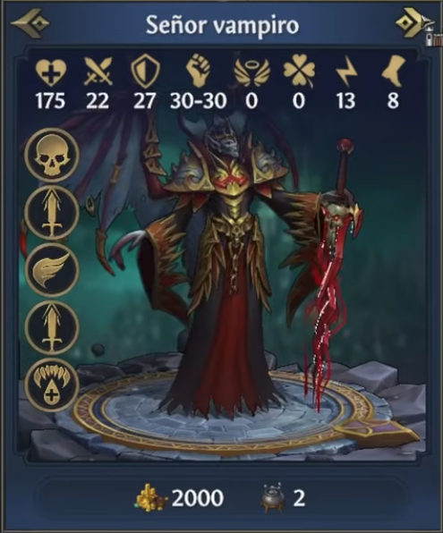
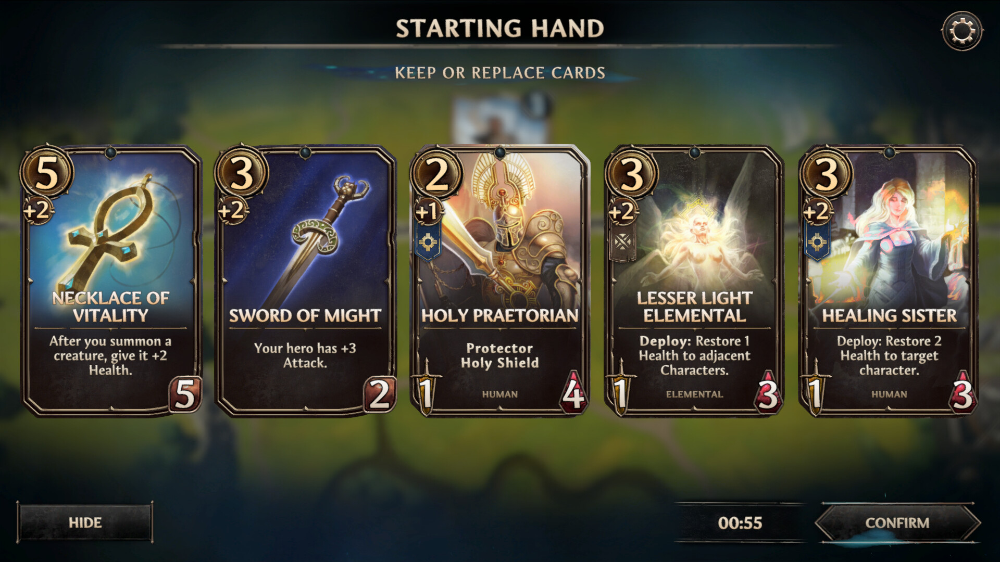
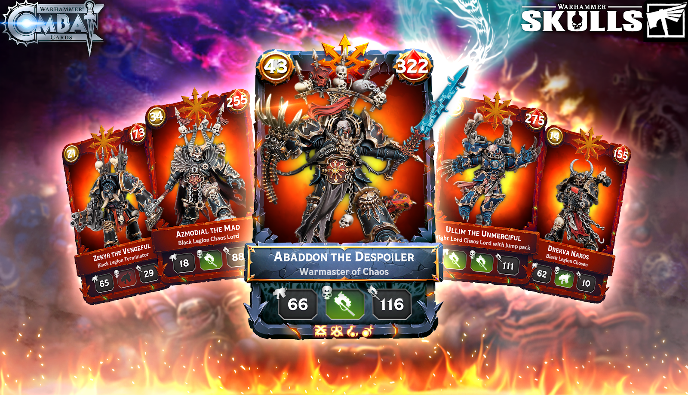
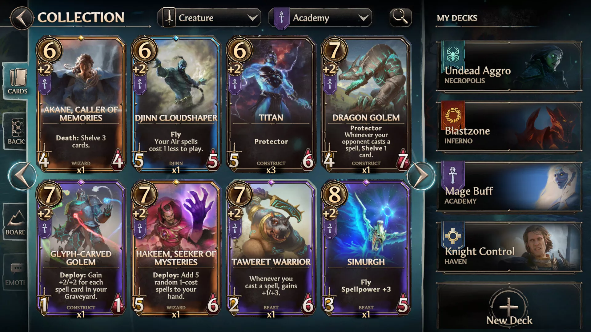

# Conceptos de marco de carta — V3

> Base de datos de referencias para **el diseño de la carta como objeto**: marco,
> disposición, tipografía, dónde caen los números. Es la tercera pata que
> faltaba, la que [`../art-direction/`](../art-direction/README.md) deja fuera a
> propósito: allí `style-guide.md` dice **cómo se dibuja** e `illustrations.md`
> dice **qué se dibuja**; aquí se decide **dónde se mete**.
>
> De esta carpeta cuelga un dato que hoy vive en otro sitio: **la medida de la
> ilustración** ([`public/assets/v3/README.md`](../../../public/assets/v3/README.md#lienzo-y-formato))
> está bloqueada por el marco que se decida aquí.
>
> Un concepto entra aquí porque algo suyo sirve, no porque guste entero. Cada
> ficha dice qué se roba y qué se descarta.

**Las imágenes viven aquí, en [`imgs/`](imgs/)**, para poder hojear los
conceptos sin salir de la carpeta. Es la excepción a la norma de
[`public/concepts/`](../../../public/concepts/): allí va la referencia visual
que se cita desde el código (la paleta, el botón con remache, la mesa del
tablero), aquí la que se está analizando para tomar una decisión de diseño.
`imgs/olden-era.png` es copia de `public/concepts/oldenEra/2.png`, que se queda
también en su moodboard.

## Contra qué se juzgan

La carta de unidad de V3 tiene que sostener **13 datos** y ningún párrafo de
prosa — a diferencia de las de v2, que eran casi todo texto de efecto:

| Bloque | Datos |
|---|---|
| Identidad | Nombre · Raza · Tier (1–8) · Rareza |
| Arte | Ilustración |
| Habilidades | Vida · Ataque · Defensa · Resistencia mágica · Precisión · Suerte · Iniciativa · Movimiento |
| Características | De 0 a **5** chips (icono + nombre) |

> **Son cinco, no cuatro.** Este documento decía "de 0 a 4" y estaba mal: en la
> tabla de unidades de [`docs/v3/razas.md`](../../../docs/v3/razas.md) hay
> **seis** unidades de tier 8 con cinco Características —🐉 Dragón esquelético,
> 👹 Balor, 🐉 Dragón ancestral, 🐙 Kraken ancestral, ⚙️ Coloso mecánico y
> 🧪 Abominación de plaga—. El marco tiene que aguantar cinco, y un chip de más
> es justo lo que rompe un raíl o una cenefa que iba justa.

> **Y el Tier no lo tienen todas.** Esa fila vale para una carta de unidad. Un
> **héroe** no tiene tier, y **no tiene nada que lo sustituya**: V3 no tiene
> progresión de personaje *(24-ago-2026, `docs/v3/status.md` §5)*, así que en una
> carta de héroe no hay ningún rango que decir. Cualquier marco que reserve un
> sitio fijo para el Tier tiene que resolver ese hueco — no esperando un dato que
> llegue, porque no va a llegar, sino poniendo otra cosa o no reservándolo. Es el
> problema que se le ve encima a la mezcla D, que lo había subido a un medallón
> del marco.

Y tiene que aguantar los dos extremos de
[`docs/v3/razas.md`](../../../docs/v3/razas.md) sin romperse:

- **🗡️ Miliciano (tier 1)** — cero Características, Vida de dos cifras, nombre
  corto. Es el que descubre los huecos que se ven vacíos.
- **🐉 Dragón dorado (tier 8)** — cuatro Características, Vida de tres cifras,
  trece caracteres de nombre. Es el techo de la raza piloto y el que descubre
  los huecos que rebosan.
- **🐉 Dragón esquelético (tier 8, No-muertos)** — cinco Características y
  dieciocho caracteres de nombre. No es de Humanos, así que no toca a la raza
  piloto, pero es el peor caso real del catálogo y por eso entra.

## Dónde se ven dibujados

En la wiki, en **Cartas › Diseño de cartas** (`/docs/v3/cards/design`). El
código está en `components/design/v3/` y sus estilos en
`styles/components/card-sketch/`.

> **Hay DOS bocetos dibujados: la mezcla E · Forja y la mezcla G · Estandarte.**
> De la primera tanda hubo cinco —uno por cada concepto de abajo, más las dos
> mezclas— y el 22 de agosto de 2026 se borraron los cuatro anteriores del
> código, con sus parciales y sus piezas. **Este documento no se borra con
> ellos**: es el razonamiento, y es de donde sale la E. Lo que se lee aquí abajo
> sigue siendo la explicación de por qué la carta es como es — solo que ya no se
> puede pinchar A, B, C ni D en la página.
>
> La segunda tanda acabó igual, y en dos días. El **F** (24 de agosto de 2026)
> no se derivaba de la E: salía de una referencia nueva y la contradecía punto
> por punto. La **G** (mismo día) sale de los dos: el octógono de la F con la
> veta de la E — y con ella montada, la F se quedó sin nada propio que enseñar,
> así que **se borró el 25 de agosto de 2026**, con su marco y su parcial. Lo
> suyo que valía está en la G; lo que discutió sigue escrito aquí abajo.
>
> Lo que queda enfrentado en la página es *rectángulo contra octógono* y *veta
> partida en cuatro tramos contra aro continuo*. Lo que ya **no** se puede mirar
> —*encendido contra acuñado*, que era la discusión de la F— está solo escrito.

**Los sujetos son la plantilla real de la raza piloto**, no una selección: las
**ocho unidades de 👤 Humanos** en su orden de progresión (tier 1 → 8) y **tres
de sus cuatro héroes** (⚔️ Guerrero, 🔮 Mago y ✝️ Sacerdote), con nombres,
emojis y Características copiados de
[`knowledge/v3/races-concept/razas.md`](../races-concept/razas.md). Los héroes
están por dos motivos: no tienen tier, y son los tres que **ya tienen
ilustración de V3** (`public/assets/v3/races/humanos/`) — falta el
🏹 Arquero, que aún no está dibujado. Aparte, etiquetado como caso límite, va
el 🐉 Dragón esquelético, que no es de Humanos pero es el único que llega a
cinco Características. Todo eso vive en `sample.ts`; lo único inventado ahí son
los valores de las 8 Habilidades, y de ellos solo importa cuántas cifras tienen.

> **Las tres cartas de héroe son las que dicen la verdad.** Son las únicas con
> arte real de este juego: las demás llevan emoji o un recorte prestado de v2,
> y un marco encima de un emoji siempre parece mejor de lo que es.

Es donde se contesta lo que este documento deja abierto, porque hay cosas —si
la fila de ocho se lee, si el cero molesta, cuánto arte se come un panel— que
no se deciden mirando referencias sino mirando la carta.

A partir del cuarto, los bocetos ya no salían de una referencia nueva sino de
**cruzar los que había** (ver §"Mezclas"). De ahí sale el que quedó.

---

## Concepto A — Olden Era

*Heroes of Might & Magic: Olden Era*, ficha de criatura (Señor vampiro).
📎 `imgs/olden-era.png`

**Es prácticamente nuestro modelo de datos ya dibujado.** De los tres es el
único que enseña ocho estadísticas a la vez y sigue siendo legible.

| Zona | Qué hace |
|---|---|
| Cabecera | Banda con cantoneras ornamentales y el nombre centrado |
| Tira de stats | **Ocho** pares icono-sobre-número en una sola fila, todos al mismo tamaño, sin etiquetas de texto |
| Raíl izquierdo | Las Características como **medallones circulares** apilados en vertical, encima del arte |
| Arte | A sangre, ocupa todo el cuerpo; el marco lo pisa |
| Pie | Economía de reclutamiento (oro y crecimiento) |

**Qué se roba.** Dos cosas, y las dos son respuestas a preguntas que teníamos
abiertas:

1. **Dónde van las ocho Habilidades**: en una tira, todas iguales, icono arriba
   y número abajo, sin jerarquía. Yo proponía cuatro grandes y cuatro finas;
   esto demuestra que con iconos buenos no hace falta jerarquizar.
2. **Cómo se resuelve el rango 0–4 de Características**: un raíl vertical sobre
   el arte. Es la mejor solución al problema del Miliciano que hemos visto,
   porque con cero medallones **no queda un hueco vacío** — queda arte. El raíl
   no es una fila de la cuadrícula, es una capa encima.

**Qué no encaja.** Es un panel de interfaz, no una carta: proporción casi
cuadrada, sin tratamiento de Rareza por ningún lado, y el pie es economía de
reclutamiento que V3 todavía no ha decidido si tiene. Imprime los ceros en vez
de ocultarlos (Suerte 0), que es una decisión a tomar aparte.

---

## Concepto B — Mano inicial (Steam, app 3918850)

📎 `imgs/steam-3918850-mano-inicial.jpg` · captura de la ficha de Steam de la app
3918850, descargada al repo porque su URL lleva sello de tiempo y caduca.

**El único de los tres que es una carta de verdad, en la mano, y a proporción
de carta.** Cinco en pantalla y todas se leen.

| Zona | Qué hace |
|---|---|
| Gema de coste | Círculo dorado grande **solapado sobre la esquina superior izquierda**, mordiendo el marco |
| Chip secundario | Un `+2` pequeño colgando bajo la gema, y bajo él un banderín de facción |
| Arte | A sangre en el ~55% superior, fundido en negro hacia el panel |
| Nombre | Versalitas doradas, filete fino debajo |
| Texto | Serif clara, centrada |
| Pines de pie | Espada abajo-izquierda (ataque) y gema roja abajo-derecha (vida), con el tipo de criatura (`HUMAN`, `ELEMENTAL`) centrado y pequeño entre las dos |

**Qué se roba.** La **proporción y la disciplina de contraste** —es la prueba
de que un diseño oscuro con oro aguanta cinco cartas juntas—, el patrón de
**colgar un valor secundario bajo el principal** (la gema con su `+2`), y los
**dos pines de esquina inferior** para los números que se consultan en cada
intercambio de golpes.

**Qué no encaja.** Solo lleva dos estadísticas. Nuestras ocho no caben en esta
disposición sin rehacerla, y la mitad inferior se la come un párrafo de
descripción que V3 **no tiene**: ese espacio es justo el que nos sobra para la
tira de stats del concepto A.

---

## Concepto C — Warhammer Combat Cards

📎 `imgs/warhammer-combat-cards.png` · lámina promocional de *Warhammer Combat
Cards*, descargada al repo porque venía de un enlace temporal de Google.

**El más agresivo de los tres, y el que enseña que se puede prescindir del
texto por completo.** Cero prosa: todo son números y glifos.

| Zona | Qué hace |
|---|---|
| Marco | Borde de piedra tosca e irregular, con puntas de flecha en las esquinas de abajo |
| Arte | **Es la carta entera**: no hay ventana de ilustración, hay ilustración con un borde encima |
| Gemas superiores | Dos, **desbordando las esquinas**: círculo dorado a la izquierda, escudo rojo a la derecha |
| Placa de nombre | Losa de piedra solapada sobre el tercio inferior, con **nombre + subtítulo** |
| Vainas de stats | Fila de tres cápsulas oscuras bajo la placa |
| Cenefa de rasgos | Tira de glifos diminutos pegada al borde inferior |

**Qué se roba.** El **subtítulo bajo el nombre** —«Warmaster of Chaos» es
exactamente nuestro «Humanos · Tier 6»—, la **cenefa de glifos** como segunda
respuesta al rango 0–4 de Características (distinta a la del concepto A: abajo
en horizontal en vez de a la izquierda en vertical), y la demostración de que
**una carta sin una sola frase puede seguir sintiéndose llena**.

**Qué no encaja.** Solo tres estadísticas visibles. Y tiene un coste que se
paga fuera de la carta: la placa se come el centro de la composición, así que
la ilustración hay que encuadrarla para ella —la cabeza de la figura tiene que
quedar alta— y eso es una restricción que vuelve a
[`../art-direction/illustrations.md`](../art-direction/illustrations.md).
Las gemas que desbordan las esquinas también atan: una carta así no se puede
recortar sin cortar números.

---

## En qué coinciden los tres

Esto es lo que más pesa, porque cuando tres referencias distintas hacen lo
mismo deja de ser gusto y pasa a ser oficio:

1. **Ninguno tiene ventana de ilustración enmarcada.** El arte va a sangre y el
   marco lo pisa por encima. El tema `armored` de v2
   ([`components/design/card-frames.tsx`](../../../components/design/card-frames.tsx))
   sí tiene ventana — por eso se nota de otra familia.
2. **Los números importantes van en las esquinas de arriba, sobre el arte**, no
   en una fila aparte. Los tres. Ganan sitio y ganan jerarquía a la vez.

   > **El concepto F matiza esto** y merece la corrección: allí solo el número
   > que decide si puedes jugar la carta (el coste) va arriba; los dos de
   > combate —ataque y vida— se van a las esquinas de **abajo**. Lo que
   > comparten los cuatro no es que los números vayan arriba, es que **van a
   > las esquinas y no a una fila**. Arriba o abajo depende de cuándo se
   > consultan.
3. **Las Características nunca son texto**: son iconos, medallones o glifos. En
   ninguno de los tres se lee la palabra.
4. **El nombre siempre va sobre una banda opaca solapada**, nunca sobre el arte
   desnudo. Es lo único que garantiza que se lea con cualquier ilustración
   detrás.

## Mezclas

Los conceptos de arriba son referencias externas. Esta sección es otra cosa:
**cruces entre lo que ya está sobre la mesa**, que es como se avanza una vez
hay bocetos que mirar. Cada mezcla dice de dónde saca el esqueleto, de dónde la
piel, y qué se descubre al juntarlos que no se veía por separado.

### Mezcla D — Blindada (boceto C × tema `armored` de v2)

> **Borrada del código** (22 de agosto de 2026). Se lee aquí porque la E sale de
> ella: es la mitad del par que decidió dónde vive la Rareza, y sin esta mitad
> la otra no se entiende. Su marco vectorial y su parcial
> (`_blindada.scss`) ya no existen.

**El esqueleto es entero del concepto C**: arte a carta entera, placa solapada
sobre el tercio inferior, las ocho Habilidades en una sola fila de cápsulas,
glifos de Característica al pie. Eso no se toca, porque es lo que se está
juzgando.

**La piel es la del tema `armored` de v2**
([`components/design/card-frames.tsx`](../../../components/design/card-frames.tsx)
y `styles/components/card-themes/_armored.scss`), que es la única pieza de v2
con un marco de verdad y no un filete. Trae tres cosas:

| Qué trae de Armored | Qué resuelve |
|---|---|
| Banda de metal de 15px con **cantoneras remachadas** en las cuatro esquinas | El marco pasa a ser un objeto, no un borde |
| El metal **es** el color de la Rareza (`--m`/`--m-hi`/`--m-lo`/`--m-edge`) | La pregunta abierta de dónde vive la Rareza |
| El **medallón** montado sobre el canto de la placa, con sus dos roblones | La pregunta abierta de cómo se dice el Tier |

**Lo que la mezcla deja fuera a propósito: la ventana de arte.** Es lo que este
documento ya señalaba en §"En qué coinciden los tres" como el motivo de que
`armored` "se note de otra familia". Sin ventana, el herraje aguanta: sigue
leyéndose como blindaje aunque el arte vaya a sangre por debajo.

**Lo que se descubre al juntarlos**, y es lo que había que ver:

- **El medallón vale para el Tier, pero se come el alto de la placa.** El
  rótulo tiene que arrancar por debajo de él —21px de aire— o se lo traga. A
  cambio el subtítulo se queda solo con la raza, así que la placa no crece
  tanto como parece.
- **Y no vale para los héroes**, que no tienen tier. Hoy el medallón les pone
  una corona, que funciona, pero deja claro que ese hueco no es "el Tier" sino
  "el rango": una casilla que cada tipo de carta rellena a su manera. Si el
  marco se queda, hay que decidir si eso es una plantilla o dos.
- **La banda cuesta 30px de fila.** Con 15px de marco a cada lado, cada cápsula
  de la fila de ocho baja de ~34px (boceto C) a ~30px. La Vida de tres cifras
  del 🐉 Dragón dorado sigue entrando, pero ya sin holgura: es el techo.
- **Un marco de Rareza es mucho más fuerte que un filete de Rareza.** Con la
  legendaria dorada la carta se lee antes por el marco que por la ilustración.
  Eso puede ser exactamente lo que se quiere o justo lo que no; es la decisión
  que este boceto pone encima de la mesa.

### Mezcla E — Forja (el boceto D, abierto por la mitad)

Boceto **E · Forja** en `/docs/v3/cards/design`. Comparte el marco vectorial
con el D (`ForjaFrame` en `components/design/v3/sketch-frames.tsx`) y tiene su
propio parcial en `styles/components/card-sketch/_forja.scss`.

Sale del D pero **acaba diciendo lo contrario que él**, y esa oposición es el
motivo de que los dos convivan:

| | Boceto D | Boceto E |
|---|---|---|
| El metal | **es** la rareza: una legendaria es una carta dorada entera | es siempre el mismo peltre (`card-sketch("alloy")`), material de carta y no dato |
| La rareza | tiñe la pieza | se reduce a una **veta de luz** entre los dos raíles del filete |
| La lectura | la carta está pintada de su rareza | la carta está **encendida** |

Las dos mitades viven en variables separadas a propósito —`armor-vars()` para
el metal, que aquí no cambia nunca, y `seam-vars()` para la luz, que es lo
único que cambia de una carta a otra—, porque son exactamente la apuesta del
boceto.

**1. El filete se abre.** La banda maciza de metal se parte en **dos raíles de
2,5px** y entre ellos queda un **canal de 7px** por el que corre la veta. La
luz no es un borde teñido: es un anillo desenfocado, otro nítido encima y un
núcleo más claro dentro, que es lo que la hace parecer encendida y no una
tercera línea de color. Las cantoneras siguen yendo por encima, así que la veta
se ve como **cuatro tramos entre placas** y no como un aro — un aro continuo
parecía un neón pegado.

Ocupa lo mismo que la banda del D (los 15px de `$sketch-band`), a propósito:
entre los dos bocetos solo cambia el aspecto, nunca el sitio, y por eso se
pueden comparar.

**2. La luz cae hacia dentro.** La veta no se queda en el filete: la carta
lleva una sombra interior del mismo color (`--seam-soft`, la veta translúcida)
que baña la ilustración desde los cuatro bordes. Sin eso la veta se lee como un
tubo de neón pegado al canto —ilumina el escenario pero no la carta—; con eso
el arte queda dentro de un farol y el color se reconoce sin mirar el borde. Va
por debajo del pie, así que la placa la tapa: la luz viene de detrás de ella,
que es lo que corresponde.

**3. Todo el blindaje es del mismo peltre**: cantoneras, placa, medallón, el
canal de la fila de ocho y los remaches del raíl. Los medallones de
Característica pasan de pastilla con aro de color a **remache**, del mismo
metal que las cantoneras.

Y la **placa del nombre va traslúcida**, poco —entre 82% y 88%, subiendo hacia
abajo, que es donde cae el rótulo—: la ilustración se intuye por debajo en vez
de cortarse a cuchillo, y la placa deja de parecer una etiqueta pegada encima.
La fila de ocho se queda opaca a propósito: un número no puede tener una
ilustración por dentro.

**4. Las Características vuelven al raíl vertical del boceto A**, y el
Miliciano sigue sin dejar hueco vacío porque con cero medallones ahí queda arte.

**5. El pie se reduce a UNA sola pieza, y las ocho Habilidades se meten
dentro de ella.** En A, B, C y D el pie es una pila de bandas —nombre, fila de
ocho, cenefa—; aquí hay una única placa **a sangre de lado a lado**, sin radios
y sin margen contra el filete, y dentro van el rótulo y los ocho números. La
carta deja de tener bandas apiladas: tiene ilustración y tiene una placa.

Eso es lo que deja al **nombre ir más grande** (`sketch-font("name-xl")`,
1,62rem frente a los 1,3rem del resto): ya no hay tres franjas repartiéndose el
tercio inferior, así que el rótulo puede mandar sin empujar nada. El escalón
para nombres largos sube con él; si el par se descompensa, «Dragón
esquelético» vuelve a partir en dos líneas y empuja la fila de ocho contra el
filete.

Y las cápsulas de Habilidad **desaparecen como pieza**: ni recuadro, ni fondo,
ni canal empotrado. Los ocho pares icono-número van sueltos sobre la chapa. Con
ocho en fila, el recuadro era la mitad de la tinta del pie y cada cifra competía
con su propia casilla. Esto **solo se lo puede permitir este boceto**, y es la
otra cosa que le compra la placa única: en el A o en el C, sin recuadro, los
números caerían sobre la ilustración.

*Antes de esto se probó con la fila de ocho arriba, en una banda de cabecera
propia. Se descartó: caía justo sobre las cabezas de las figuras, que es la
franja que `illustrations.md` manda dejar visible.*

**6. El medallón lleva la RAZA, y con eso la placa se queda sin subtítulo.** El
disco que el D usaba para el Tier aquí no lleva número: lleva el **emblema de la
raza** (💀 en el Dragón esquelético, 👤 en los humanos). Y como la raza ya está
dicha —en imagen, no en letra—, la línea de «👤 Humanos · Tier 8» desaparece
entera: bajo el nombre no queda nada escrito.

Lo que hacía esa línea se reparte en dos piezas que ya existían: la raza la dice
el medallón y el rango, **el color de la veta** —que en una unidad sale del tier
y en un héroe es su raíl rojo propio—. Es el reparto que este boceto lleva
haciendo desde el principio llevado hasta el final: la carta enseña, no escribe.

El medallón cambia de cara para poder hacerlo. En el D es un disco de piedra
casi negro, que va bien detrás de una cifra dorada y fatal detrás de un emoji: un
emoji trae sus propios tonos y no acepta color, así que necesita **papel claro**
detrás o se lee como una mancha —👤 sobre el disco negro era exactamente eso—. Va
de peltre claro, misma lección que las fichas del tablero (`$piece`: oro claro
bajo el cofre).

Y va **desnudo**: el D le pone dos remaches a los lados y aquí no están, porque
aquí no hay nada que remachar. En el D la placa está atornillada al marco y los
remaches son la explicación de por qué se sostiene; en el E la placa es del
mismo metal que el marco y va a sangre, así que los dos puntos no sujetaban nada
— eran dos manchas más en la única banda de la carta que se lee.

**Lo que se descubre:**

- **Sacar la rareza del metal resuelve solo el problema que el D tenía con la
  placa.** Allí había que dejarla negra para que el oro de una legendaria no se
  tragara el rótulo, y el precio era que marco y placa parecían dos objetos
  distintos. Con el metal fijo, el bisel de la placa se ajusta **una vez** y
  vale para las once cartas.
- **Una línea de luz basta para reconocer la rareza**, incluso siendo lo único
  de color en toda la carta — y deja la ilustración completamente en paz, que
  es lo que el D no hacía.
- **Pero necesita el derrame hacia dentro para que sea luz y no un borde.** Con
  la veta sola, el color se queda en el canto y la carta parece una lámina
  neutra con una moldura de colores; con la sombra interior, la ilustración
  entera está bañada y el tier se reconoce mirando al centro de la carta. Es la
  diferencia entre pintar el marco y encender la carta.
- **Con la común la veta no se lee como luz sino como cromo**, porque el color
  de esa rareza es casi blanco. No es un fallo del boceto: es que la escala de
  `$rarity` arranca en un gris y una luz gris no es una luz.
- **El raíl de Características ya no puede arrancar en la esquina**, porque
  ahí está la cantonera. Empieza 12px más abajo que en el boceto A, y eso hay
  que tenerlo en cuenta si el marco final lleva herrajes.
- **Las ocho Habilidades no pueden ir arriba.** Se probó en una banda de
  cabecera y caía justo sobre las cabezas de las tres ilustraciones definitivas
  de héroe: el encuadre sube la figura para que la cara quede en el tercio alto
  (`object-position: 50% 28%`) y la banda se comía exactamente esa franja. La
  parte inferior de una carta es la única que la dirección de arte da por
  perdida, así que ahí es donde caben los datos.
- **Ir a sangre resuelve el aire, pero se come 15px por cada lado.** La placa va
  de x=0 a x=300 y es el marco, que se pinta encima, quien le recorta los
  extremos: así queda pegada al canto interior del filete sin ningún margen que
  ajustar. El precio es que hay que descontar el filete a mano en los
  acolchados —si las ocho columnas reparten los 300px enteros, el Dragón dorado
  pierde el primer dígito de sus 240 de Vida.
- **Y el bisel de la placa hay que recalibrarlo cuando la placa cambia de
  altura.** Con la fila de ocho dentro mide el doble, y el degradado
  proporcional que se ajustó para la placa baja dejaba el rótulo grande sobre
  la zona clara de la chapa. Los cortes van pronto (6% / 18% / 44%) y no
  repartidos: el filo de luz se queda en el canto de arriba y el cuerpo se
  apaga antes de que llegue el nombre.
- **Un emblema sustituye a una línea de texto, y se lee antes.** El 💀 del
  Dragón esquelético frente al 👤 de cualquier humano se distingue sin leer, y
  quitar el subtítulo es lo que más aligera el pie de los cinco bocetos. El
  reparo no es del marco sino del catálogo: el emoji de Humanos es una silueta
  genérica, así que un emblema de raza solo funciona si `razas.md` da iconos que
  se distingan entre sí a 42px.
- **Un emoji necesita papel claro debajo.** No toma color ni familia
  tipográfica: lo único que se le puede gobernar es el tamaño, y todo lo demás
  lo decide el fondo. Es la misma regla que ya estaba escrita para las fichas
  del tablero (`$piece`), y ahora también vale para la carta.
- **La veta dice el tier, no la rareza** — o al menos eso es lo que se quiere
  que diga. Hoy lee `--rarity`, que en las unidades es función directa del tier
  (`rarityForTier`), así que son **cinco escalones para ocho tiers**. Si el tier
  tiene que verse en ocho, hace falta una escala propia en `styles/settings/`;
  y en las cartas de héroe, que no tienen tier, la veta no puede decirlo.

  **Y desde el punto 6 esto ya no es un matiz.** Mientras el tier estaba escrito
  en el subtítulo, el color era un refuerzo; ahora es lo único que lo dice, y con
  cinco escalones la carta solo puede decir de qué **clase** de tier es. El
  Miliciano (1) y el Arquero (2) son la misma carta gris. O se acepta que la
  carta no diga el tier exacto, o hace falta esa escala de ocho.

---

## Concepto F — Might & Magic: Fates

📎 `imgs/might-magic-fates-heroes-tcg-pc-cd-key-4.webp` · pantalla de colección
de *Might & Magic: Fates*, descargada al repo porque venía de un enlace de
tienda con sello de tiempo.

> **Rompe el orden de este documento a propósito.** A, B y C son referencias y
> D y E son mezclas; esta es una referencia que llega **después** de las
> mezclas, así que se escribe aquí y no arriba, para que el documento se lea en
> el orden en que pasaron las cosas. La letra sigue la serie de bocetos, que es
> una sola: A, B, C, D, E, F.

**Es la referencia más completa de las cuatro, y la única que enseña ocho cartas
a la vez en la mano.** Lo que la separa de las tres primeras no es la piel: es
que **discute la silueta**. Las cinco cartas que teníamos son el mismo
rectángulo redondeado; estas están **achaflanadas**, y se reconocen de lejos por
la forma antes que por el color.

| Zona | Qué hace |
|---|---|
| Silueta | **Octógono**: las cuatro esquinas cortadas a 45°, con un remate metálico en cada corte |
| Canto | Filete fino **teñido** que rodea la silueta entera (bronce, azul, morado…), con el cuerpo del marco en piedra oscura y un **hilo claro** pegado al arte |
| Disco superior izquierdo | Círculo dorado grande con el **coste**, montado sobre el chaflán y desbordándolo |
| Fichas colgadas | Un `+2` pequeño bajo el disco y, bajo él, un **banderín de facción** |
| Gema superior | Rombo pequeño **a caballo del canto de arriba**, en el eje del nombre |
| Arte | A sangre en el ~60% superior, **disuelto** en el panel (no cortado) |
| Nombre | Versalitas centradas sobre el panel, con un **filete fino debajo** |
| Panel | Texto de reglas centrado, en un bloque oscuro que ocupa el tercio inferior |
| Pines de pie | **Hoja de acero abajo-izquierda** (ataque) y **gema roja abajo-derecha** (vida), con el **tipo de criatura** en versalitas diminutas centrado entre las dos |

**Qué se roba.** Cuatro cosas, y las cuatro son respuestas a preguntas que este
documento tenía abiertas o dadas por cerradas de más:

1. **La silueta como identidad.** Es lo que ninguno de los cinco bocetos
   preguntó. Un chaflán no es un adorno: cambia dónde caben las piezas y obliga
   a que lo que va en la esquina la desborde en vez de meterse dentro.
2. **La jerarquía entre los números.** Aquí no todos valen igual: el coste
   manda, los dos de combate van a las esquinas de abajo con forma y color
   propios, y el resto no existe. Es exactamente lo que el concepto B ya
   señalaba —«los dos pines de esquina inferior»— y que **ningún boceto llegó a
   dibujar**: A, C, D y E ponen los ocho al mismo tamaño en la misma fila.
3. **El color en el canto, no en el cuerpo.** El marco es piedra oscura en las
   ocho cartas y lo que cambia es un filete de dos píxeles. Es la vía intermedia
   entre el filete de 3px de A/B/C —que se pierde— y el marco entero teñido de
   la mezcla D, que se come la carta.
4. **El fundido en vez del corte.** El arte no termina contra el panel: se
   disuelve en él a lo largo de unos 60px. Es lo que hace que el panel parezca
   el fondo de la carta y no una etiqueta encima, y es más barato que la placa
   traslúcida de la E.

**Qué no encaja.** Lo de siempre, y una cosa nueva:

- **Solo lleva tres números.** Nuestras ocho Habilidades no caben en esta
  disposición sin rehacerla — pero **el hueco existe**: lo que aquí ocupa el
  párrafo de reglas, en V3 está libre, porque nuestras cartas no llevan prosa.
  Ese hueco es lo que hace la réplica posible.
- **Tiene dos taxonomías y nosotros una.** La facción (Academy) y el tipo de
  criatura (WIZARD) son dos ejes distintos; V3 solo tiene la raza. Media docena
  de fichas de esta referencia existen porque su juego tiene ese segundo eje.
- **Las esquinas cortadas son un troquel.** Si alguna vez se imprime, esta
  silueta no es un corte recto. No bloquea nada hoy, pero conviene tenerlo
  escrito antes de que sea una decisión tomada por inercia.

### Boceto F — Blasón (la réplica del concepto F con el modelo de V3)

> **Borrado el 25 de agosto de 2026**, un día después de dibujarse. No porque
> fallara: porque la **G · Estandarte** se quedó con todo lo suyo que valía —la
> silueta, el disco del Tier, los dos pines, el rótulo en versalitas, el fundido
> del pie— y lo único que ya no compartían era *dónde vive la Rareza*, que es
> justo lo que esta perdía. Con las dos en pantalla, la F era la G con el color
> en otro sitio y un hilo de oro; borrada, la página gana una comparación limpia
> —rectángulo contra octógono— en vez de tres cartas que se parecen dos a dos.
> Su marco (`BlasonFrame`) y su parcial (`_blason.scss`) se fueron con ella.
>
> **Lo de aquí abajo no se borra**, por lo mismo que A, B, C y D: es el
> razonamiento, y la mitad de lo que la G es hoy salió de montar esto. Solo que
> ya no se puede pinchar.

**No salía de la E**, y estuvo a su lado para discutirle cuatro cosas que
aquella daba por cerradas:

| | Boceto E · Forja | Boceto F · Blasón |
|---|---|---|
| La silueta | rectángulo redondeado, como los cinco | **octógono** con roblón en cada chaflán |
| La Rareza | **dentro** del metal: una veta de luz por el canal del filete | **el canto**: filete duro de 2,2px alrededor de la silueta, más un rombo en el borde de arriba |
| Los ocho números | todos iguales, en una fila de ocho | **dos en las esquinas** (⚔️ y ❤️, con forma y tamaño propios) y **seis en rejilla 3×2** |
| El Tier | no se escribe: lo dice el color de la veta | **se escribe**, en número, en el disco de la esquina |
| La raza | emblema en el medallón | **escrita** en versalitas al pie |

La frase corta: **encendido contra acuñado**.

**1. El contorno se corta.** Un octógono de chaflán 18px (`$sketch-chamfer`,
espejo de la `C` del marco vectorial). El arte y el pie se recortan con el mismo
polígono en CSS y el marco lo dibuja en SVG, así que las dos medidas se mueven
juntas o el filete se despega de la silueta. El marco suma **los mismos 15px**
que la banda de la E (`$sketch-band`) a propósito: entre bocetos cambia el
aspecto, nunca la medida.

Y el contorno tiene una consecuencia que se nota enseguida: **la carta no puede
pintar su propio fondo**. Sus esquinas ya no son las de su caja, así que el
relleno del rectángulo asomaría por fuera del octógono como cuatro manchas. El
fondo lo pone el arte, que sí va recortado.

**2. El color va al canto.** Cuatro anillos: filete de Rareza (2,2px) → cuerpo
de la aleación (8,7px) → **hilo de oro** (1,7px) → sombra contra el arte. El
filete lleva un halo corto por debajo; corto a propósito, porque pasado cierto
punto deja de ser un canto y se convierte en la veta de la E. Y un **rombo** de
Rareza a caballo del borde de arriba, en el eje del nombre: el canto se ve de
lejos y el rombo se ve en la mano.

**3. Los ocho números dejan de ser iguales.** ⚔️ Ataque y ❤️ Vida se van a las
esquinas de abajo en pines con punta —hoja de acero a la izquierda, gema de
sangre a la derecha— y a mayor cuerpo; los otros seis se quedan en una rejilla
de **3×2** en el hueco que la referencia dedica al texto de reglas. El icono del
Ataque sigue siendo el del **tipo de daño**, como en la E, así que la esquina
dice cuánto pega y de qué manera.

**4. La carta vuelve a escribir.** El Tier en número dentro del disco, y la raza
en versalitas al pie, donde la referencia pone el tipo de criatura. Es la
posición contraria a la de la E, que enseña y no escribe, y ahora se pueden
mirar las dos.

**5. Y lo que la referencia tiene y aquí no está: el banderín de facción.** No
cabía sin repetir algo. La raza ya se escribe al pie; el tipo de daño ya viaja
pegado al número de Ataque desde la E y ahí no cuesta un pixel. Es la parte de
la réplica que más enseña: **media docena de fichas de una referencia existen
porque su juego tiene un eje que el nuestro no tiene**, y rellenarlas sin ese
eje es decorar.

**Lo que se descubre al montarlo:**

- **La franja de abajo hay que reservarla con acolchado.** Fue el primer fallo:
  ni los pines ni la línea de raza están en el flujo —los pines viven fuera del
  pie, porque montan sobre el marco y el pie va recortado—, así que la segunda
  fila de la rejilla les caía encima. El panel reserva 48px (`$pin-band`) para
  una franja que no contiene nada suyo.
- **Los pines no pueden apilar icono y número.** Apilados crecen a lo alto, y a
  lo alto es donde no hay sitio: cada píxel que sube el pin se lo quita a la
  rejilla. En línea caben en la franja y de paso dejan el número más grande, que
  es lo que el pin viene a hacer.
- **Un `clip-path` se come el `box-shadow`.** Los pines y los medallones van
  recortados, así que la sombra la pone el **padre** con `filter: drop-shadow`,
  que sigue la silueta ya recortada. Es la única forma de darle contorno a una
  pieza troquelada.
- **El filete de Rareza se lee mucho mejor que la veta**, y no por sutileza sino
  por área: son 2,2px alrededor de la silueta entera contra 7px en un canal
  tapado por las cantoneras en las cuatro esquinas. En la fila de once, el verde
  del Caballero y el azul del Grifo se distinguen sin buscarlos. La común sigue
  siendo el caso malo, y por lo mismo que en la E: `$rarity` arranca en un gris.
- **El rojo del héroe choca con el rojo de la Vida.** El pin de ❤️ Vida es la
  gema roja de la referencia, y en una carta de héroe acaba a juego con el
  filete del marco: las dos cosas rojas de la carta dejan de distinguirse. O el
  héroe cambia de color, o la Vida no puede ser roja. **No estaba visto**: en la
  E la Vida es un número más de la fila y no tiene color.
- **El peso 300 no aguanta las versalitas.** El rótulo de la E va en Platypi 300
  y en caja mixta; en caja alta y a cuerpo pequeño una fina no tiene trazo con
  el que sostenerse, así que aquí sube a **500**. O la carta titula en fino y en
  caja mixta, o titula en versalitas y necesita peso. Las dos a la vez, no.
- **El hilo de oro desaparece con los metales claros.** Es una cosa más que
  mirar al pasar la probeta de aleación: en latón y en oro el hilo se funde con
  el cuerpo del marco y el marco pierde la mitad de su relieve.
- **El apilado icono-sobre-número no es una ley, es una medida.** El esqueleto
  tiene escrito que el apilado *es* la pieza —en fila, icono y cifra dejan de
  leerse como un par—, y se escribió con **ocho** en una fila de 33px. Aquí son
  **seis** en tres columnas de ~85px y en línea aguantan. La regla era de la
  anchura.
- **El disco tiene que desbordar el chaflán.** Metido dentro no cabe: la esquina
  cortada es justamente el sitio que ya no hay. Desbordándolo se lee como un
  sello colgado y no como un botón dibujado, que es lo que hace la referencia —
  pero convierte la carta en una pieza que **no se puede recortar** sin cortar
  el Tier, el mismo reparo que el concepto C ya tenía.
- **El fundido largo es más barato que la placa traslúcida.** La E apoya el
  texto en una chapa de metal al 82-88%; aquí no hay chapa, hay 44px de pie
  oscureciéndose más un panel que arranca **en transparente** y llega a su velo
  al 15%. Cuesta dos degradados y no hay que recalibrar ningún bisel cuando el
  panel cambia de alto. El precio es que el rótulo no puede caer en el tramo a
  medio teñir: de ahí los 20px de acolchado de arriba del panel.

### Mezcla G — Estandarte (el octógono de la F con la veta de la E)

*(24 de agosto de 2026.)* La primera mezcla desde la E, y la primera que no
discute nada: con dos bocetos en la mesa que se contradicen en cuatro puntos, lo
que faltaba era una carta que se quedara con **lo mejor de cada uno** — y, de
paso, separar preguntas que hasta ahora venían pegadas.

Porque el problema de comparar la E con la F es que cambian **cuatro cosas a la
vez**. Si la F gusta más, no se sabe si es por la silueta, por el canto teñido,
por la jerarquía de los números o por el disco del Tier. La G fija tres y mueve
una: **mismo octógono, misma jerarquía, mismo disco, y la Rareza vuelve a ser
luz**. Puesta al lado de la F, lo que se veía era exactamente la respuesta a *si
lo que gustaba era la forma o el color del canto*.

Y esa comparación duró un día: **la G se llevó todo lo que la F tenía de
bueno**, así que la F se borró el 25 de agosto de 2026 y en la página quedan la
E y la G. La tabla se queda con las tres columnas porque es el acta de cómo se
llegó aquí, pero la del medio ya no se puede pinchar.

| | E · Forja | F · Blasón *(borrada)* | G · Estandarte |
|---|---|---|---|
| **Silueta** | rectángulo redondeado | octógono | octógono |
| **Rareza** | veta de luz en el canal | filete en el canto | veta de luz en el canal |
| **Remate de esquina** | cantonera en L | roblón en el chaflán | roblón en el chaflán |
| **La veta** | cuatro tramos entre cantoneras | — | **un aro continuo de ocho lados** |
| **Los ocho** | ocho iguales en fila | 2 pines + rejilla 3×2 | 2 pines + **una fila de seis** |
| **Rombo** | — | cara plana | **piedra tallada** |
| **Raza** | emblema en el medallón | texto al pie | **emblema en estandarte + texto al pie** |
| **Hilo de oro** | — | sí | no cabe |

**1. La Rareza vuelve dentro del metal.** El filete se parte otra vez en dos
raíles con el canal de luz entre medias (`SEAM`, el mismo de la E, dibujado con
`Ring` en vez de con `Band`), y vuelve el **baño** que derrama hacia dentro sobre
la ilustración. El canto teñido de la F desaparece: la carta vuelve a estar
encendida en vez de acuñada, pero con la silueta cortada.

Con una diferencia que no es de detalle: **la veta da la vuelta entera**. La E
lleva sus cuatro cantoneras encima del canal, así que allí la luz se ve como
cuatro *tramos* entre placas —metal recién forjado entre chapas— y aquí no hay
escuadra ninguna, solo el roblón del chaflán de la F, que le pasa por encima sin
cortarla. El canal se cierra en un **aro de ocho lados**. Es la tercera cosa que
se puede mirar en la página, y en el fondo es la misma pregunta que la del
material: si la luz tiene que parecer **una pieza de metal caliente** o **un
contorno encendido**.

**2. El rombo se talla.** En la F es una cara de color girada 45°, que a 15px es
una mancha. Aquí son tres capas: **engaste** de metal, **cuatro facetas** que se
cortan en la mitad —un `conic-gradient` sobre una caja girada, así que los cortes
caen en la vertical y la horizontal del rombo— y una **tabla** con su destello.
Sube a 20px, porque a 15 la tabla se quedaba en dos píxeles y medio.

**3. Cuelga un estandarte de raza del disco del Tier.** Es la ficha que la
réplica había dejado en blanco: en la referencia ahí va el banderín de la
facción, y V3 no tiene facción. Se dibuja con lo único que hay, la **raza**, en
emblema — que es la respuesta que ya daba la E. Y la carta la dice ahora **dos
veces**, porque el texto al pie sigue ahí: es deliberado, y es la única forma de
mirar juntas en una misma carta las dos respuestas que la E (emblema sin texto) y
la F (texto sin emblema) daban por separado.

**4. Las seis del panel van juntas, en una fila.** La rejilla de 3×2 salía del
párrafo de reglas de la referencia y leía como un bloque de texto; en una fila
leen como lo que son, una tira de valores. El panel pierde un renglón entero
—unos 26px— y ese sitio se lo queda la ilustración.

**Lo que se descubre al montarlo:**

- **Se probó a traerse también las cantoneras de la E, y se descartó.** El primer
  montaje llevaba su escuadra en L con la punta cortada a 45° para apoyarse en el
  chaflán, con el argumento de que la E corta el canal en las esquinas por algo.
  **No es lo que quiere este boceto**: el remate de la F es un roblón, no una
  placa, y con las cuatro escuadras encima la carta dejaba de parecer la mezcla
  de las dos para parecer la E con las esquinas limadas. Lo que queda es el aro
  continuo, y eso es una respuesta más que se puede mirar, no un descuido.
- **O hilo de oro o veta, no las dos.** El canal se come los 7px centrales del
  filete y la E ya reparte los 15 enteros entre raíles y lip. La primera cosa que
  la mezcla obliga a elegir, y el motivo es de espacio — que suele ser el más
  honesto.
- **El baño de luz hay que recortarlo al octógono.** La sombra interior se pinta
  sobre una caja rectangular y el hueco que tiene que bañar tiene ocho lados, así
  que sin `clip-path` las cuatro esquinas del baño asoman por los chaflanes,
  donde la carta ya no tiene carta. Y el chaflán de dentro **no es el de fuera**:
  al meter el borde 15px, el corte encoge `C − d(2 − √2)` — la misma cuenta que
  hace `octagon(d)` en el TSX, repetida en Sass.
- **El apilado icono-sobre-número era de la anchura, y ahora está probado.** La E
  lo apila con ocho columnas de 33px; la F lo pone en línea con tres de ~85px y
  aguanta; la G tiene seis de ~41px y el par en línea ocupa 39 de los 41 — dos
  vecinos se tocan y la fila se lee como una tapia, así que vuelve a apilarse.
  **Por debajo de unos 60px hay que apilar; por encima se puede elegir.** Tres
  bocetos para cerrar una regla que llevaba desde el A escrita como si fuera de
  la pieza.
- **La bandera necesita cara clara y el medallón cara oscura, y no es una
  contradicción.** El estandarte lleva el emblema de la **raza** (👤, una silueta
  oscura) y el medallón del raíl lleva **Características** (💀, 🐾, glifos
  claros). Un emoji no acepta color: lo que hay detrás tiene que hacerle de
  papel, y el papel que hace falta depende del glifo. Es la misma lección que las
  fichas del tablero, y la G la tiene puesta en las dos direcciones a la vez.
- **La sombra de una pieza recortada tiene que vivir en el padre, y a veces hay
  que inventarle uno.** Los pines y los medallones ya lo hacían; el estandarte no
  tiene hermanos, así que **la bandera es su `::before`**: el clip va en el hijo
  y el `drop-shadow` en el elemento, que no está recortado. Un `filter` en el
  mismo elemento que el `clip-path` no vale — se aplica antes de recortar, así
  que la sombra se recorta con la pieza.
- **Una carta cortada no puede llevar sombra de caja, y eso vale también para
  la F.** Se vio aquí porque este boceto lleva el halo fuerte de la E: una
  `box-shadow` sigue el borde de la **caja**, y la caja de un octógono sigue
  siendo un rectángulo, así que el halo iluminaba el fondo pegado a las cuatro
  esquinas *que ya no existen* y los cuatro chaflanes quedaban como un trozo
  negro entre el marco y el resplandor. No lo pintaba nadie: era el fondo sin
  iluminar, recortado por la luz de al lado — y por eso cuanto más fuerte el
  halo, más se veía. La sombra pasa a `filter: drop-shadow()`, que sigue la
  **silueta ya compuesta** —el arte va recortado— y dobla por el corte. Es el
  mismo truco que ya usaban los pines y el raíl, una capa más arriba. Las dos
  piezas viven en la misma capa —`z("chip")`, la de lo que monta sobre el
  marco— y entre iguales manda el orden del árbol, así que el TSX dibuja la
  bandera *antes* que el disco. Bajarle el z-index la habría metido debajo del
  marco, que es la capa siguiente, y entonces dejaría de montar sobre el filete.
  Con la bandera detrás, sus 10px de arriba no se ven nunca: se le quitó el
  cordón de oro que llevaba ahí, porque era tinta que no ve nadie — lo que
  sujeta la bandera es el disco. El emblema, en cambio, tiene que bajar hasta
  librar el disco **entero** y no solo su caja: el disco es un círculo y por el
  eje de la bandera su canto de abajo cae más abajo que en los lados.
- **El rombo se centra en el filete, no en el canto.** Su eje cae en la mitad de
  la banda de metal, así que la piedra se lee montada *sobre* el marco. Medio
  píxel más arriba y parece que se cae de la carta.
- **El rojo del héroe choca aún más que en la F.** El pin de ❤️ Vida es rojo y en
  una carta de héroe el marco también: en la F es un filete de 2,2px y aquí es
  una **veta encendida que baña media carta**. El roce que la F encontró, la G lo
  agranda.
- **La anatomía octogonal se sacó a un mixin, y al día siguiente se deshizo.**
  Mientras hubo dos bocetos octogonales, el contorno, el pie, el panel, el
  rótulo, la línea de raza, el disco, el raíl y los pines vivían en un mixin
  (`_octagon.scss`) y en un componente (`OctagonCard`), porque escrito dos veces
  se habría separado en la primera corrección. Al borrarse la F **volvieron
  dentro de la G**: una pieza compartida con un solo consumidor deja escrito en
  el código que hay dos cosas cuando ya solo hay una. Se comprobó con un diff de
  píxeles contra la captura anterior — lo único que se movió son los cuatro
  roblones, **una décima de píxel**, porque su posición se medía desde el reparto
  de anillos de la F y ahora se mide desde el de la G.

## Lo que esto cambia de lo ya escrito

**El lienzo heredado de v2 era el equivocado, y ya está corregido.** La
especificación vigente
([`public/assets/v3/README.md`](../../../public/assets/v3/README.md#lienzo-y-formato))
arrastraba 1536×1050 —apaisado— porque era la medida de las cartas de v2. **Todos
los conceptos son verticales** y en todos la ilustración ocupa la carta entera,
así que la ilustración de carta es **vertical y a sangre**, no un recorte
apaisado con los bordes tapados.

Cerrado el 21 de agosto de 2026: **5:7 (1080×1512)**, que es el de la carta
construida (300×420), **plano general con aire y figura centrada**, con el cuarto inferior
reservado a la banda del nombre. No hacía falta esperar a que ganase un boceto:
los cinco comparten proporción y los cinco van a sangre. Lo destapó la primera
tirada de arte real —tres héroes apaisados, en plano medio y descentrados dentro
del marco vertical—, que es exactamente para lo que servía tener los bocetos
montados.

Anotado también en [`docs/v3/status.md`](../../../docs/v3/status.md) §6.

## Qué falta decidir

> Los puntos de abajo son los que se contestan en `/docs/v3/cards/design`, con
> los bocetos delante.

- **Si la carta es un rectángulo.** *(Abierto desde el 24-ago-2026.)* Los cinco
  primeros bocetos no lo preguntaron: los cinco son la misma caja redondeada con
  distinta piel. El **F** la cortó —octógono de chaflán 18px, con roblón en cada
  corte— y el **G** se quedó esa silueta, así que borrada la F la pregunta queda
  **una contra una**: rectángulo (E) contra octógono (G), que es la comparación
  más limpia que ha tenido la página. No es una piel: es lo primero que se
  reconoce a distancia de mesa, obliga a que el disco del Tier **desborde** la
  esquina en vez de caber dentro, y si algún día se imprime es un troquel y no un
  corte recto. Es la decisión más barata de tomar mirando y la más cara de
  cambiar después.
- **Cuál de los esqueletos se toma de base**, o qué híbrido: el candidato
  obvio es *proporción y paleta de B + tira de ocho de A + subtítulo y ausencia
  de texto de C*. La mezcla D va por otro lado —deja C intacto y le cambia la
  piel—, así que las dos vías siguen abiertas. Y desde el F hay una tercera, que
  no es un híbrido de las anteriores y hoy la sostiene el **G**: *silueta y
  jerarquía de números de la réplica + fundido en vez de placa*.
- **Dónde vive la Rareza.** Ninguno de los tres primeros conceptos la trata: A y
  C no la tienen y B la insinúa con el color del arte; el F sí, y la pone en el
  canto. En v2 se resolvió en el borde (halo + filete tintados) y esa decisión
  sigue siendo buena. Hay **cuatro** respuestas dibujadas, y las tres últimas son
  opuestas y no grados de lo mismo: **filete** de 3px (A, B, C) → **el marco
  entero teñido** de la rareza (D) → **el marco siempre igual, con la rareza
  reducida a una veta de luz por dentro del metal** (E) → **el canto de la
  silueta teñido, más un rombo en el borde de arriba** (F). Elegir es decidir
  cuánto tiene que gritar la rareza antes de robarle la carta a la ilustración,
  y si el marco es una pieza distinta por rareza o una sola pieza con color en un
  sitio — que también es una decisión de producción.

  De lo que se vio mientras el F estuvo montado: **su filete se lee antes que la
  veta del E**, y no por sutileza sino por área —2,2px alrededor de la silueta
  entera contra 7px en un canal que las cantoneras tapan en las cuatro
  esquinas—. Las dos fallan igual con la común, porque `$rarity` arranca en un
  gris.

  El **G** no añadía una quinta respuesta: repetía la del E dentro de la silueta
  del F, y sirvió para **separar la forma del color** — que hasta entonces venían
  pegados, porque el único octógono que había era también la única carta con el
  canto teñido. Contestado eso, la F se borró, así que **el canto teñido ya no
  está dibujado en ningún sitio**: si vuelve a la mesa hay que volver a montarlo,
  y esta vez sobre la silueta que se elija.
- **Si los ocho números van todos iguales.** *(Abierto desde el 24-ago-2026.)*
  A, C, D y E dicen que sí: misma fila, mismo cuerpo, mismo peso, y la ventaja es
  que la carta no elige por ti. El **F** dijo que no y sacó ⚔️ Ataque y ❤️ Vida a
  las esquinas de abajo, con forma y tamaño propios — que es lo que el concepto B
  ya señalaba como digno de robar y nadie había dibujado; el **G** heredó ese
  reparto y solo cambió cómo se agrupan los otros seis, así que sigue en
  pantalla. La pregunta de fondo no es de maquetación: es si el marco puede
  **congelar** cuáles son los dos números de combate antes de que las reglas
  estén cerradas.
- **Si el icono va encima del número o al lado.** *(Contestado el 24-ago-2026.)*
  El esqueleto lo tenía escrito como si fuera una propiedad de la pieza —en fila,
  icono y cifra dejan de leerse como un par— y se había medido con **ocho** en
  columnas de 33px. El F lo probó con **seis** en columnas de ~85px, donde en
  línea aguanta, y el G con **seis** en columnas de ~41px, donde no: el par en
  línea ocupa 39 de los 41 y la fila se lee como una tapia. **La regla era de la
  anchura**: por debajo de unos 60px hay que apilar, por encima se puede elegir.
- **Si la carta puede decir la raza dos veces.** *(Abierto desde el
  24-ago-2026.)* La E la dice en **emblema** y no la escribe; la F la **escribía**
  en versalitas al pie y no la dibujaba; el G hace las dos cosas —emblema en el
  estandarte que cuelga del disco, texto al pie— para poder compararlas en la
  misma carta, y por eso el punto sobrevive a la F: la comparación no dependía de
  tenerla delante, está entera dentro de la G. Una de las dos sobra, y decidir
  cuál es decidir también qué pasa con el hueco: si sobra el estandarte, la carta
  se queda sin la ficha que la referencia dedica a la facción, que es un eje que
  V3 no tiene.
- **Cuánto detalle aguanta una pieza pequeña.** *(Abierto desde el 24-ago-2026.)*
  El rombo de la Rareza se dibujó de dos maneras: **cara plana** de 15px (F) y
  **piedra tallada** con engaste, cuatro facetas y tabla (G), que además tuvo que
  crecer a **20px** porque a 15 la tabla se quedaba en dos píxeles y medio. Eso
  ya es media respuesta: la talla no cabe en la medida de la plana. Queda la otra
  mitad, que solo contesta la imprenta — si a 63mm las facetas se emborronan y
  queda una mancha más sucia que la plana. Vale igual para los roblones y el
  bocel del marco.
- **Si los ceros se imprimen o se ocultan.** A los imprime; con Suerte 0 en
  media plantilla, ocultarlos deja huecos irregulares en la tira.
- **Si el Tier se escribe o se enseña.** A, B y C lo escriben en el subtítulo; la
  mezcla D lo sube al medallón del marco y le quita el subtítulo; la **E no lo
  escribe en ningún sitio** y paga que solo puede decir de qué *clase* de tier es
  —cinco escalones para ocho tiers, el Miliciano y el Arquero son la misma carta
  gris—; el **G lo escribe otra vez**, en número, en el disco de la esquina, que
  es lo que la referencia hace con el coste. Las dos posiciones extremas están
  dibujadas y se pueden mirar juntas.
- **Qué pone donde va el Tier en una carta de héroe**, que no lo tiene. Hoy
  A, B y C escriben «Héroe» en el subtítulo, la D y la G ponen una corona en
  el disco, y la E disuelve el problema —su medallón lleva la raza, no un número, así
  que no hay hueco que rellenar—. **Ya no depende de nada**: V3 no tiene
  progresión de personaje *(24-ago-2026,
  [`docs/v3/status.md`](../../../docs/v3/status.md) §5)*, así que no hay ningún
  número esperando ese hueco y la respuesta se elige libre — un emblema, una
  palabra, o no reservar el sitio. Lo que el G enseña es el coste de reservarlo:
  quien reserva, rellena.
- **Si el rojo sangre es el color de los héroes.** Ya está puesto: un héroe no
  está en la escala de rareza —no tiene tier— y prestarle un escalón decía que
  un Sacerdote es "más legendario" que un Guerrero, que es falso. Así que tiene
  **raíl propio** en `$rarity`, junto a las otras categorías que tampoco son
  escalones de rareza (`"clase"`, `"enemigo"`). Es la sangre de `game("accent-hi")`: el
  único hueco de color que quedaba —ninguna de las cinco rarezas es roja— y de
  paso la constante de identidad de la interfaz, así que no hay color nuevo que
  inventar. Queda por decidir solo si ese rojo se comparte con algo más (en v2 lo
  tenía la carta de Enemigo, en un tono vecino). **Todos los héroes van iguales**:
  no hay ningún número que los ordene entre sí.

  **El boceto octogonal le ha encontrado un roce** *(24-ago-2026)*: su pin de
  ❤️ Vida es la gema roja de la referencia, y en una carta de héroe acaba a juego
  con el color del marco — las dos cosas rojas de la carta dejan de
  distinguirse. Se vio primero en la **F**, donde el marco rojo era un filete de
  2,2px; en la **G** es una veta encendida que además baña la ilustración
  entera, así que se ve bastante peor. O el héroe cambia de color, o la Vida no
  puede ser roja. En la E no se veía, porque allí la Vida es un número más de la
  fila y no tiene color propio.
- **Dos Características distintas con el mismo emoji** — *destapado aquí,
  resuelto en el catálogo (22-ago-2026)*. El héroe ⚔️ Guerrero de Humanos llevaba
  🛡️ Resistente al daño físico y 🛡️ Último aliento, y como las Características se
  dibujan en glifo y sin texto, la carta enseñaba el mismo icono dos veces. Se
  arregló en `razas.md` dando a Último aliento su propio 😤 —que además deja de
  mentir, porque es un buff de daño y no de defensa—, junto con otros seis
  glifos que colisionaban por accidente. **Lo que sigue repitiendo glifo son las
  familias elementales** (🔥 Fuego / Resistente al fuego / Inmune al fuego, y sus
  equivalentes de ☠️ y 🧊), y ahí es deliberado: el glifo compartido dice que van
  del mismo tema, y lo que falta por marcar es el *papel*, que es tratamiento
  visual del icono y no otro dibujo. Anotado en `docs/v3/status.md` §6.
- **De qué metal es la carta.** Se puede preguntar en la E y en la G: en las dos
  el metal no lleva ningún dato —en el D *es* la rareza— y por tanto el
  tono es una decisión libre. Está montada una **probeta** en el
  lab (`$sketch-alloy` en `styles/settings/_colors.scss`, selector "Aleación" en
  la página) con **catorce** candidatos ordenados de oscuro a claro, para que la
  fila se lea como una escala: carbón, pavonado, hierro, cardenillo, óxido,
  acero, **peltre** —el de ahora—, cobre, bronce, estaño, latón, plata, oro y
  marfil. Dos se salen de la familia a propósito, y son los que contestan una
  pregunta más grande que el tono: el **cardenillo** (verde de pátina, el único
  que no es gris ni dorado) y el **marfil**, que ya no parece metal sino hueso —
  están para ver si el marco tiene que ser metálico siquiera.
  Cada uno es **un solo color**: `armor-vars()` le saca la
  luz, la sombra y el filo, así que aquí no se elige una paleta, se elige un
  material. Lo que hay que juzgar no es el marco suelto sino las cosas que se
  apoyan en él —el oro del rótulo, el emblema del medallón, que necesita cara
  clara, la veta de rareza, que se apaga si el metal ya es de su tono, y en la G
  el **estandarte** de raza, que necesita cara clara por lo mismo que el
  medallón: en carbón o pavonado el 👤 se pierde—. La probeta mueve los dos
  marcos a la vez, a propósito: comparten aleación para que lo que se compare sea
  el marco y no el color. Cuando se decida, el ganador pasa a `"alloy"` y la
  probeta se borra entera.
- **Qué tipografía titula la carta.** Hasta ahora el nombre iba en **Cormorant**
  (`$font-serif-display`), la serif de libro que se heredó de las cartas de v2 sin
  discutirla: correcta y neutra, dice "documento" antes que "objeto de juego".
  Está puesta **Platypi** —serif de titulación de remates de pala,
  `$font-sketch-display`, cargada en `components/design/v3/sketch-fonts.ts`— en
  los cinco bocetos a la vez, para poder juzgarla sin que cambie nada más. Se
  carga **variable (300–800)**, y eso no es un detalle de producción: el rótulo
  se puede mover de peso sin descargar un archivo por escalón, que es lo que no
  dejaban hacer las dos display que se probaron antes (Skranji, 400/700;
  Girassol, un solo peso). Está puesta en **300**, el extremo ligero del eje, y
  con el cuerpo un punto más bajo que al principio (1.46/1.14rem, era
  1.62/1.24): en fino el rótulo se lee como una inscripción y deja mandar al
  arte, mientras que grabado y macizo competía con los números. Eso mueve la
  jerarquía del contraste al **aire**, y arrastra una medida: en el boceto E la
  fila de ocho pasa de 10 a 16px de separación, porque a diez el nombre fino y
  los números macizos se leían como un solo bloque. «Dragón esquelético» sigue
  entrando en una línea. Las cartas de v2 siguen con Cormorant: el token es nuevo
  y no sustituye al viejo.

  **Y el F encontró el límite del 300** *(24-ago-2026)*: titulaba en
  **versalitas**, como su referencia, y una versal fina y a cuerpo pequeño no
  tiene trazo con el que sostenerse — ahí el rótulo sube a **500**, y el G lo
  heredó junto con las versalitas. O la carta titula en fino y en caja mixta (E),
  o titula en versalitas y necesita peso (G). Las dos a la vez, no. La caja alta
  arrastra además su
  propia escala, porque ocupa más ancho por carácter y no tiene descendentes: el
  par corto/largo de los octógonos va un escalón por debajo del de la E aunque el
  panel sea igual de ancho.
- **Dónde van las Características: raíl vertical o cenefa al pie.** El raíl
  (A, E, F y G) resuelve mejor el caso vacío —con cero medallones queda arte— y
  deja el pie más limpio; la cenefa (B, C y D) no toca la ilustración. El E enseña
  el coste del raíl cuando el marco lleva herrajes: hay que bajarlo para que no
  se meta debajo de la cantonera. El G enseña otra cosa: **de qué lado cae no lo
  decide la pieza, lo decide lo que ya ocupa la esquina** — se va a la derecha
  porque la izquierda se la llevan el disco del Tier y el estandarte que cuelga
  de él, y sus medallones dejan de ser redondos para repetir el octógono de la
  carta en pequeño.
